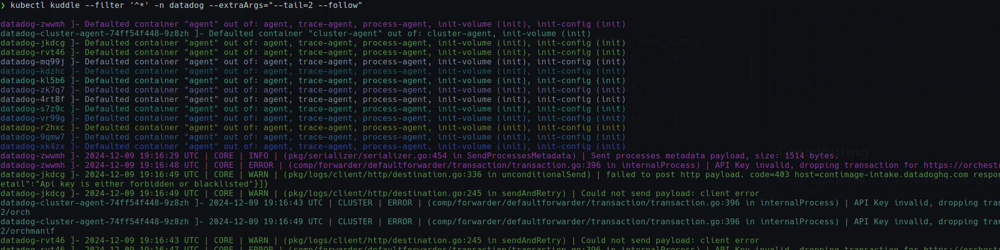

# kuddle

[](https://goreportcard.com/report/github.com/ashiqursuperfly/kuddle)

Simple CLI that extends the functionality of kubectl logs to display logs from multiple pods matching a filter.

## Installation
Go binaries are automatically built with each release by [GoReleaser](https://github.com/goreleaser/goreleaser). These can be accessed on the GitHub [releases page](https://github.com/ashiqursuperfly/kuddle/releases) for this project.

### Krew
This project can be installed with [Krew](https://github.com/GoogleContainerTools/krew):
```
kubectl krew install kuddle
```

## Usage
```
❯ kubectl kuddle --help

Usage:
kuddle [options] --filter <regex> [additional kubectl logs flags]
0.0.1
Options:
  --filter <regex>              Regex to filter pod names (mandatory). Must be matchable using go regexp: regex.MatchString
  -n, --namespace <namespace>   Namespace to query pods from (default: "default")
  --extraArgs                   flags to be passed into kubectl logs command
  --help                        Show this usage information%
```

- Each log line follows the following format: `<pod-name> ]- <log-line>`
- Log lines coming from each unique pod will have it's own unique color for better visibility.



## Contributing
Always open to new features. Feel free to raise a PR from your fork!

## License
Apache License 2.0